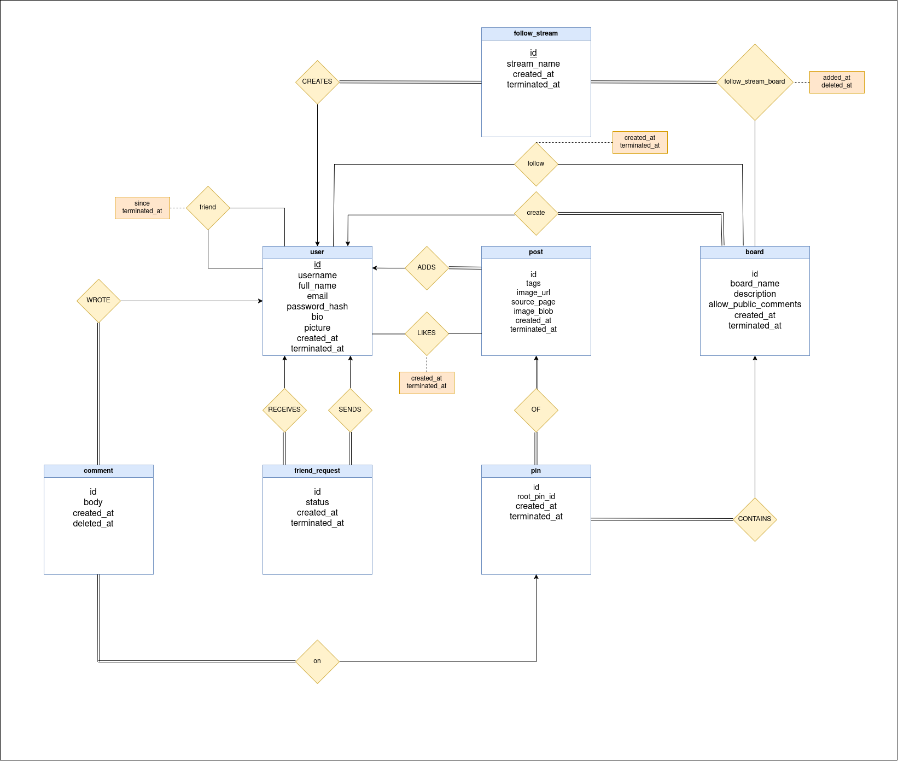

# 📚 Database Schema — Pinboard Project

This directory contains all database-related scripts for the Pinboard project — a Pinterest-like application where users can create boards, pin posts, like posts, follow streams, and manage friendships.

---

## 📂 Structure

- `/tables/init_schema.sql`	— Creates all tables (pure schema only, no procedures).
- `/functions/*.sql`		— Individual stored procedure scripts (one function per file).
- `/diagrams/*.png`		— Entity-Relationship (ER) and Relational diagrams.
- `init_database.sql`		— Master script that sets up tables and stored procedures together.

---

## 🛠 Setup Instructions

1. Make sure PostgreSQL is installed on your system.

2. Create a new database:
   ```bash
   createdb pinboard_db
   ```

3. Connect to database:
   ```bash
   psql -U <your_username> -d pinboard_db
   ```
   
4. Exit psql and run the full database setup script:
   ```bash
   psql -U <your_username> -d pinboard_db -f db/init_database.sql
   ```

## Entity-Relationship Diagram


